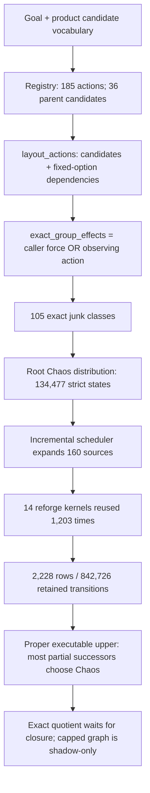
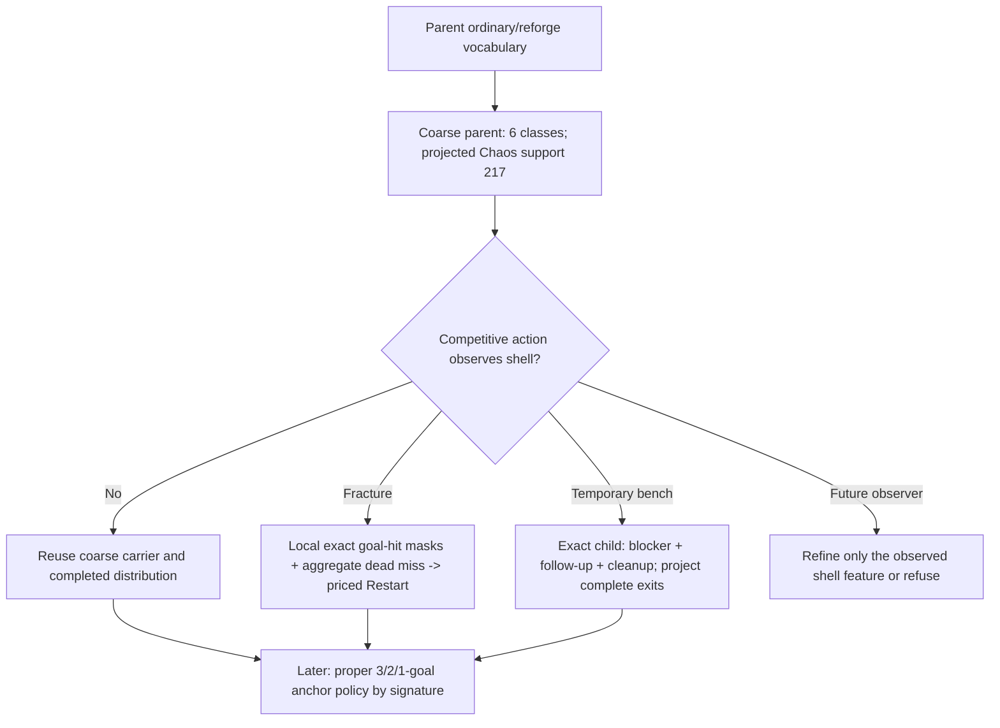

# Practical Exact Four-Goal Solving Research Report

**Status: completed evidence and architecture investigation; no optimization
implemented.**

Parent: [Practical Exact Four-Goal Solving Research](README.md)

Verified 2026-07-29 against
`fc8787750445b89c7dadc37db7b4007bc7c74b87`, the compiled current artifact,
and the frozen PPPS case
`natural-t1-full-four-47d8b909aa88`. Mechanics in this report are Oliver's
stated planning assumptions or already implemented behavior; no online
mechanic research was used.

## Executive answers

1. **Are zero-goal carriers causing the explosion? No.** They are `1,031` of
   `200,000` states (`0.516%`), and only two zero-goal states were expanded.
   The broad completed rows are overwhelmingly sourced from one-goal states:
   `158/160` Chaos, `870/880` Harvest, and `174/176` Fossil rows. Zero-goal
   successors dominate the *current upper contribution* because the incumbent
   sends them back through Chaos, but they do not dominate retained population
   or row production.
2. **What does Chaos cover?** The strict root Chaos row covers `134,477`
   states. Every completed root Mana-Fossil and Harvest support is a subset of
   it with different probabilities: overlap equals support for all six rows,
   with zero exceptional, persistent, or rarity/shape-only states. Other
   actions still create important non-Chaos states later: `33,660` discovered
   states carry Fracture identity, and incremental telemetry records `33,015`
   states outside Chaos support.
3. **Why 105 precise junk classes?** Two independent mechanisms suffice:
   the public solver constructor unconditionally requests complete
   group-exclusion identity, and admitted Fracture is itself an exact observer.
   The current candidate list contains Fracture and no Remove Crafted
   Modifiers dependency. Attack/caster temporary-bench observation would
   create `11` coarse classes and `114` exact classes in its local vocabulary.
4. **Does Fracture independently poison the global abstraction? Yes.** Core
   action-driven layout: `6` classes and `217` projected Chaos carriers. Add
   Fracture: `105` classes and `134,477` carriers. Direct Fracture fanout is
   only `706` entries, so its global identity effect is far larger than its
   direct row cost.
5. **Does dependency-only cleanup independently poison it? Counterfactually
   yes; actually no in this case.** Adding Remove Crafted Modifiers to the
   parent vocabulary also changes `6 -> 105` classes and `217 -> 134,477`
   carriers. But cleanup is marked dependency-only and no fixed parent option
   adds it to `layout_actions` here (`dependency_primitives = 0`). Temporary
   blocker programs synthesize it inside state-local exact child contexts.
6. **How much upper can anchors remove? Potentially almost all, but only after
   the one-goal layer exists.** Repricing the retained Chaos row with a uniform
   executable value for every one-to-three-goal successor gives `10,011.56`,
   `1,011.56`, or `511.56` at anchor values `10,000`, `1,000`, or `500`,
   reductions of `99.9834%`, `99.9983%`, and `99.9992%`. These are sensitivity
   scenarios, not available policies. A good anchor needs to cover only about
   `10.0%` of Chaos partial-progress mass to cross the frozen 10% root gate,
   but three-goal mass is only `0.014794%` of partial mass and two-plus-three
   is `2.28273%`; useful one-goal policies are essential.
7. **Can a retained core plus disposable shell work? Yes as an
   action-relative representation, not as a global merge.** The measured
   `217`-carrier projection proves that ordinary/reforge actions need very
   little shell identity. The existing preservation metadata and exact child
   contexts provide the refinement hooks. Fracture, Annul, Exalt, Augment,
   cleanup, and other shell observers must refine or use a local exact
   operator; the previous zero-progress audit correctly rejects erasing the
   shell under every retained action.
8. **Next milestone:** choose **A, clarified as a Fracture-local coarse-parent
   prototype**. Remove the unconditional parent force-exact setting, replace
   product-solver Fracture misses with one aggregate priced-Restart branch, and
   keep the exact primitive unchanged outside product solving. This directly
   targets the measured `134,477 -> 217` root identity collapse. A
   three-goal-anchor prototype is the next layer after this gate, because
   anchors on strict IDs would improve values without removing the immediate
   discovery wall.

## Measurement identity and limits

| Item | Result |
| --- | --- |
| Primary command | `poecraft_solver_benchmark ... --case natural-t1-full-four-47d8b909aa88 --skip-verification --goal-progress-gated-reforges --max-discovered-states 200000` |
| Status | `refused_state_cap` |
| States | `200,000` discovered; `160` expanded |
| Bound | `L = 432.40685295343258`; `U = 60,341,416.98784247` |
| Work | `2,228` rows; `842,726` retained transition entries; `114,754,781` outcome entries; `16,746,695` reforge work |
| Reforge reuse | `14` unique kernel evaluations; `1,203` carrier reuses |
| Selected ownership | `83,929,484` live bytes; `134,289,701` peak bytes |
| Determinism | transition hash `d4346e90f923332c`; policy hash `8b2a568f3c9cfd35` |
| Bounded run wall | `14.601 s`, including finalization-only projection audits |
| Long run | Not repeated. The preceding owner-stopped 387,556-state evidence was reused. |

The diagnostic output is observational. It runs only under the existing
default-disabled `high_impact_executable_uppers` benchmark option and after an
incumbent and transition cache exist. It changes no transition, value, policy,
candidate, or cap.

## Current architecture map



| Component | Current behavior | Evidence |
| --- | --- | --- |
| Layout construction | Candidate actions plus primitive programs and conditional dependencies feed `build_abstract_layout`; complete exclusion identity is enabled by a caller flag or Unveil, Harvest conversion, Fracture, or cleanup. | `engine/src/solver_calc.cpp:319-362` |
| Junk key | Side, discriminating tag bits, goal-block mask, veiled role, optional complete exclusion-effect mask, and count-observation bits define the partition. | `engine/src/solver_abstract.cpp:397-523` |
| Public parent force | `pc_solver_create` passes `true` for complete group effects. | `engine/src/solver_api.cpp:831-833` |
| Retry basin | Gated destructive reforges project zero progress to a virtual retry-basin state. Ordinary salvage actions remain unavailable there. | `engine/src/solver_reforge.cpp:740-787`; `engine/src/solver_abstract.cpp:687-690` |
| Shared reforge work | Exact carrier signatures reuse completed kernels; the current run performs 14 builds and 1,203 reuses. The rejected shared structural DAG saved no evaluator work. | `engine/src/solver_reforge.cpp:320-381`; [shared-frontier report](../2026-07-28-harvest-shared-reforge-frontier/report.md) |
| Automatic actions | Candidates are synthesized per carrier in a local context. The current incremental anchor graph considers only primitive Fracture; selected automatic rows are zero. | `engine/src/solver_options.cpp:2580-2675` |
| Temporary blockers | Only carriers without a crafted mod qualify. Variants are grouped by follow-up, goal slot, blocker side, and the follow-up-specific blocked eligible pool. Cleanup is required and priced. | `engine/src/solver_options.cpp:595-731` |
| Constructive policies | Deterministic bench finishes, renewal-plus-finish, Multimod, protected-side programs, and progressive Fracture already publish proper executable witnesses. | `engine/src/solver_options.cpp:556-594,1391-1440`; `engine/src/solver_solve_constructive.cpp:1854-2171,2429-2834` |
| Progressive Fracture | Goal hits enter post-Fracture modes; every non-goal hit adds Restart cost and anchor coefficient, then receives `Restart + anchor` in the policy. Exact evaluation has already interned each miss. | `engine/src/solver_solve_constructive.cpp:2651-2685,2812-2817` |
| Eldritch side intent | Four state-local real-resource side intents are synthesized and evaluated in exact child contexts. None appears in this bow run. | `engine/src/solver_options.cpp:409-555,1465-1521` |
| Quotient timing | Full row closure is required before exact behavioral refinement. An unfinished cap run reports shadow groups only and retains strict working IDs. | `engine/src/solver_solve_quotient.cpp:887-965`; [exact-quotient report](../2026-07-27-exact-quotient-audit/report.md) |

### Do not conflate these quantities

| Quantity | Meaning in this run |
| --- | --- |
| Direct transition fanout | Entries in one completed action row; Fracture max is `6`, Chaos max is `134,477`. |
| Retained state IDs | Interned abstract identities; exactly `200,000` at the stop. A state can appear in several action supports. |
| Raw evaluator successor work | `114,754,781` action outcome entries and `16,746,695` reforge work before sparse graph reuse/collapse. |
| Global abstraction width | `105` junk classes, but `AbstractState` remains a fixed `152` bytes with up to six sparse nonzero counts. Class count primarily costs identity fragmentation, not a 105-byte dense vector per state. |
| Option synthesis work | Per-carrier generation/evaluation outside primitive row fanout. The archived root probe generated 481 temporary blocker variants and collapsed 423 to 58 effects without retaining a row. |
| Executable-upper quality | Continuation values/policy properness. It can improve without reducing state identity, and a smaller graph can still have a weak upper. |

## State and work attribution

### Satisfied goals

The root probability and contribution columns sum six completed root rows, so
their probability total is approximately `6`, not an occupancy distribution.

| Satisfied | States | Expanded | Root-row mass | Current upper-Q contribution |
| ---: | ---: | ---: | ---: | ---: |
| 0 | 1,031 | 2 | 5.345500833 | 322,555,094.76 |
| 1 | 144,595 | 158 | 0.631868125 | 38,127,818.02 |
| 2 | 47,377 | 0 | 0.022458834 | 1,355,197.88 |
| 3 | 6,994 | 0 | 0.000171966 | 10,376.67 |
| 4 | 3 | 0 | 0.000000242 | 0 |

| Mask | Goal placement | States | Expanded | Root-row mass |
| ---: | --- | ---: | ---: | ---: |
| 0 | none | 1,031 | 2 | 5.345500833 |
| 1 | suffix slot 0 | 33,346 | 0 | 0.307755468 |
| 2 | prefix slot 1 | 41,620 | 0 | 0.237178246 |
| 3 | slots 0,1 | 11,151 | 0 | 0.014832643 |
| 4 | prefix slot 2 | 34,814 | 0 | 0.053241680 |
| 5 | slots 0,2 | 8,978 | 0 | 0.002857011 |
| 6 | slots 1,2 | 6,323 | 0 | 0.001588396 |
| 7 | slots 0,1,2 | 2,179 | 0 | 0.000091918 |
| 8 | prefix slot 3 | 34,815 | 0 | 0.033692732 |
| 9 | slots 0,3 | 8,978 | 0 | 0.001704322 |
| 10 | slots 1,3 | 6,323 | 0 | 0.001197994 |
| 11 | slots 0,1,3 | 2,179 | 0 | 0.000061936 |
| 12 | slots 2,3 | 5,624 | 0 | 0.000278468 |
| 13 | slots 0,2,3 | 1,937 | 0 | 0.000013000 |
| 14 | slots 1,2,3 | 699 | 0 | 0.000005112 |
| 15 | all | 3 | 0 | 0.000000242 |

PresentBelowTier masks are `0: 133,702`, `1: 16,228`, `4: 21,218`,
`5: 2,061`, `8: 21,756`, `9: 2,061`, `12: 2,853`, and `13: 121`.
The only expanded masks are `0` (`69`), `4` (`13`), `8` (`70`), and `12`
(`8`).

### Occupancy, shell width, and persistent features

| Prefix/suffix occupancy | States | Expanded |
| --- | ---: | ---: |
| 0/0 | 3 | 2 |
| 0/1, 0/3, 1/0, 1/2, 2/1, 3/0 combined | 227 | 0 |
| 1/3 | 6,189 | 30 |
| 2/2 | 7,567 | 30 |
| 2/3 | 29,236 | 0 |
| 3/1 | 2,893 | 49 |
| 3/2 | 20,040 | 24 |
| 3/3 | 133,845 | 25 |

| Nonzero junk classes in state | States | Expanded |
| ---: | ---: | ---: |
| 0 | 24 | 2 |
| 1 | 860 | 8 |
| 2 | 12,146 | 46 |
| 3 | 50,731 | 72 |
| 4 | 75,729 | 27 |
| 5 | 60,510 | 5 |

| Feature | States | Expanded |
| --- | ---: | ---: |
| Fractured | 33,660 | 0 |
| Crafted | 0 | 0 |
| Protection/metamod | 0 | 0 |
| Eldritch | 0 | 0 |
| Any persistent flag | 33,661 | 1 |

### Producing/observing action families

`Observed states` is support membership, not first-creator provenance. First
creator is one of the missing counters listed later.

| Family | Rows | Successor entries | Max row | Observed states | Zero-goal observed | Rows from goal-count 0 / 1 |
| --- | ---: | ---: | ---: | ---: | ---: | ---: |
| Chaos | 160 | 21,516,320 | 134,477 | 134,477 | 1 | 2 / 158 |
| Harvest reforge | 880 | 77,896,720 | 134,400 | 167,442 | 1 | 10 / 870 |
| Fossil | 176 | 15,330,064 | 93,306 | 118,375 | 1 | 2 / 174 |
| Add/remove | 694 | 10,652 | 68 | 4,149 | 1,028 | 4 / 690 |
| Fracture | 158 | 706 | 6 | 706 | 0 | 0 / 158 |
| Restart | 160 | 160 | 1 | 1 | 1 | 2 / 158 |

The `1,030` ordinary zero-goal carriers are therefore mostly *outputs* of
add/remove actions, not expanded sources of broad reforge work. All `1,031`
zero-goal states are live-renewable, none is certified dead, and all but the
existing retry basin are observed by retained non-renewal actions. Filtering
them globally would be unsound and, even if it were allowed, would remove at
most `0.515%` of IDs in this run.

## Chaos coverage and exceptional support

| Root action | Support | Shared with Chaos | Exceptional / persistent / shape-only | Goal-count mass 0 / 1 / 2 / 3 / 4 |
| --- | ---: | ---: | ---: | --- |
| Chaos | 134,477 | 134,477 | 0 / 0 / 0 | .913512134 / .084513569 / .001961486 / .000012795 / .000000017 |
| Mana Fossil | 93,306 | 93,306 | 0 / 0 / 0 | .826658218 / .165520634 / .007759686 / .000061380 / .000000082 |
| Harvest attack | 134,400 | 134,400 | 0 / 0 / 0 | .926007952 / .072488241 / .001494337 / .000009458 / .000000012 |
| Harvest cold | 63,619 | 63,619 | 0 / 0 / 0 | .922785084 / .075391302 / .001808516 / .000015064 / .000000034 |
| Harvest elemental | 105,872 | 105,872 | 0 / 0 / 0 | .927290014 / .071247825 / .001453651 / .000008499 / .000000011 |
| Harvest mana | 66,241 | 66,241 | 0 / 0 / 0 | .818300766 / .173448415 / .008187521 / .000063217 / .000000082 |
| Harvest physical | 106,538 | 106,538 | 0 / 0 / 0 | .924458799 / .073771708 / .001755124 / .000014348 / .000000022 |

All shared states have different probabilities from Chaos. No relevant
Essence row completed in this bounded run, so Essence support is unmeasured
rather than zero. Full goal-mask probabilities are emitted for every completed
row by the retained audit.

The shared-frontier mechanism reuses carrier IDs and 1,203 completed carrier
kernels, but each action still owns its probability distribution and row
work. “Chaos finds the state” therefore means only that the state ID exists.
It does not install a competitive continuation value there. Under the current
incumbent, `5.999999758` of the six root-row probability units selects Chaos
again; only terminal mass `2.4195e-7` selects another continuation.

## Abstraction-width ablation

`Driven` means complete group effects are enabled only by the actions in that
row. `Forced` reproduces the public caller's unconditional flag. Chaos support
is a deterministic projection of the already completed strict root row;
distributions were not recomputed. All projections had zero failures.

| Vocabulary | Drivers / tags | Junk classes coarse / driven / forced | Root Chaos support coarse / driven / forced |
| --- | --- | ---: | ---: |
| Core ordinary/reforge (35) | none / none | 6 / 6 / 105 | 217 / 217 / 134,477 |
| Core + Fracture | Fracture / none | 6 / 105 / 105 | 217 / 134,477 / 134,477 |
| Core + cleanup | Remove Crafted Modifiers / none | 6 / 105 / 105 | 217 / 134,477 / 134,477 |
| Core + temporary bench vocabulary | cleanup / attack,caster | 11 / 114 / 114 | 543 / 134,477 / 134,477 |
| Core + Harvest resistance conversion | none in this case / none | 6 / 6 / 105 | 217 / 217 / 134,477 |
| Core + Unveil | Unveil / none | 6 / 105 / 105 | 217 / 134,477 / 134,477 |
| Core + Fracture + temporary bench | cleanup, Fracture / attack,caster | 11 / 114 / 114 | 543 / 134,477 / 134,477 |
| Complete current registry vocabulary | cleanup, Fracture / attack,caster | 11 / 114 / 114 | 543 / 134,477 / 134,477 |

This table separates direct fanout from layout effect. Fracture has only 706
direct entries yet independently expands root identity by `619.7x`.
Harvest-resistance conversion does not add a driver because no applicable
conversion action was generated for this goal vocabulary; this is a
case-specific result, not a general mechanic statement.

### Fracture compression estimate

Every measured Fracture source has one satisfied goal. Exact rows contain 706
entries across 158 sources. Keeping one goal-hit successor and one aggregate
miss per row gives 316 entries:

- direct transition saving: `390/706 = 55.24%`;
- final-run transition saving in isolation: `390/842,726 = 0.0463%`;
- direct state-ID saving ceiling: at most the 548 individual miss entries
  (`0.274%` of the state cap), and none of those successors was expanded here;
- layout saving, if the unconditional caller force is also removed:
  `105 -> 6` classes and `134,477 -> 217` root Chaos carriers
  (`99.8386%` support reduction);
- raw reforge evaluator work: no measured reduction; coarse projection merges
  outputs but does not by itself avoid pool enumeration.

The proposed product operator is exact under Oliver's stated rule that every
non-goal Fracture hit is dead and Restart-priced. If that rule ever changes,
the aggregate branch must refuse rather than approximate. Exact Calculator and
Emulator Fracture remains uniformly random over all explicit modifiers.

### Bench attribution

The brief's suspected parent dependency is not present. Cleanup is
`automatic_dependency_only`, and `layout_actions` adds dependencies only from
fixed parent operators. No temporary option is installed in the initial
incremental graph, so dependency primitives are zero.

The last archived state-local root probe did perform the exact synthesis:

| Temporary-bench measurement | Count |
| --- | ---: |
| Carriers | 1 |
| Precompiled exact blocker classes | 429 |
| Candidate variants | 481 |
| Follow-up-specific effect groups | 58 |
| Collapsed equivalent variants | 423 |
| Candidate decisions / eligible | 212 / 212 |
| Raw option outcomes | 1,610 |
| Unique templates / template hits | 15 / 197 |
| Retained rows / transitions | 0 / 0 |
| Total synthesis time | 35.489 ms |

In the current 200,000-state run, automatic rows considered/eligible/selected
are `159/158/0`; these are primitive Fracture rows, not temporary bench rows.
No evidence shows temporary blockers preventing zero-goal canonicalization in
this run. Their exact cleanup observer can remain local: admission already
requires no existing crafted modifier, so the cleanup removes the one known
temporary blocker, and variants are already grouped by the follow-up-specific
blocked pool.

## Anchor library research

The 14 nonterminal PPPS masks are:

- one-goal: `1, 2, 4, 8`;
- two-goal: `3, 5, 6, 9, 10, 12`;
- three-goal: `7, 11, 13, 14`.

Slot `0` is the suffix goal; slots `1-3` are prefix goals. “Three total
affixes” is not the proposed state. The signature retains goal modifiers and
only action-relevant shell observations:

```text
satisfied mask + below-tier mask
+ goal side placement and side occupancy/capacity
+ goal-blocking mask
+ fractured/crafted/protection/metamod state
+ Eldritch dominance state
+ action-relative disposable-shell refinement
```

The observational grouping found 217 such coarse signatures across the six
root rows. The top 32 signatures hold `5.80963` of six probability units and
`350.561M` of `362.048M` current upper contribution, but this is a grouping
ceiling, not a merge or a policy.

Existing exact machinery can seed the small policies: deterministic bench and
Multimod finishes, constructive renewal-plus-finish, temporary blocker
repeats, protected-side programs, four Eldritch side intents, Annul/Exalt and
Harvest Augment, progressive Fracture, and the independently successful
three-prefix/three-suffix solves. Reforge, Annul, Eldritch, and setup repeats
make the problem cyclic; each published anchor must be a proper Markov policy,
not an assumed DAG.

The safe order remains three-goal, two-goal, one-goal, comparing weak one-goal
anchors with same-base renewal. A shell is refined only when a competitive
action observes it. Completed root/action distributions are projected and
reused.

## Oracle repricing

For the retained Chaos row:

```text
p0 = 0.91351213364415884          zero-goal renewal mass
p1..3 = 0.08648786635585740       partial-progress mass
V(A) = (1 chaos + p1..3 * A) / (1 - p0)
```

| Scenario | Uniform one-to-three-goal anchor | Repriced root Chaos | Reduction vs current U | Crosses 10% |
| --- | ---: | ---: | ---: | --- |
| Current fallback | 60,341,416.99 | 60,341,428.55 | -0.000019% | No |
| 10,000-chaos anchor | 10,000 | 10,011.56 | 99.983408% | Yes |
| 1,000-chaos anchor | 1,000 | 1,011.56 | 99.998324% | Yes |
| 500-chaos anchor | 500 | 511.56 | 99.999152% | Yes |
| Optimistic ceiling only | 0 | 11.56 | 99.999981% | Yes |

Every completed Fossil/Harvest row also clears its own 10% row gate under all
four improved scenarios. None becomes strictly cheaper than the correspondingly
repriced Chaos row in these *uniform* scenarios. This does not show those
actions are bad; action-specific anchors could rank them differently, and
their current intervals remain unresolved.

The maximum uniform anchor that still crosses the root 10% gate is
`54,307,263.73`. If only some partial mass is covered, the required fraction
is:

| Covered continuation | Minimum fraction of partial mass | Root probability mass |
| ---: | ---: | ---: |
| 10,000 | 10.00168% | 0.00865024 |
| 1,000 | 10.00018% | 0.00864895 |
| 500 | 10.00010% | 0.00864887 |
| 0 ceiling | 10.00002% | 0.00864880 |

Chaos partial mass is `97.7173%` one-goal, `2.26793%` two-goal, and
`0.014794%` three-goal. Thus a three-goal prototype is necessary scaffolding
but cannot directly qualify the root; the staged values must propagate through
two-goal and then one-goal policies.

## Ranked opportunities

| Rank | Opportunity | Measured or estimated effect | Confidence / risk |
| ---: | --- | --- | --- |
| 1 | Fracture-local coarse parent plus removal of unconditional force-exact | Measured root support `134,477 -> 217`; classes `105 -> 6`; root retained transitions can fall by `134,260`. Raw evaluator work is not promised to fall. | Highest measured leverage; medium exactness work, bounded by explicit local witnesses. |
| 2 | Staged 3/2/1-goal anchor library on coarse signatures | Oracle final-layer upper reduction `99.98%+`; only about 10% of partial mass needs a strong value for the 10% gate. | High value potential, but policy coverage and properness are unmeasured; larger implementation. |
| 3 | Temporary cleanup remains action-local | Prevents the counterfactual `217 -> 134,477` parent explosion. Current parent benefit is zero because cleanup is already absent. | Architectural guardrail, not a standalone milestone. |
| 4 | Aggregate Fracture misses only | Saves 390 direct entries and at most 548 miss IDs; no expanded downstream work in this run. | Exact and small, but insufficient unless paired with layout de-poisoning. |
| 5 | Zero-goal filtering | At most 1,030 ordinary IDs; no broad rows sourced from them in the measured run. | Low benefit and globally unsound under retained observers. |

Impact estimates by requested combination:

| Combination | State/work estimate |
| --- | --- |
| Zero-goal policy filtering alone | `<= 1,030` IDs (`0.515%`); no measured broad-row saving. Reject globally. |
| Fracture miss compression alone | `390` direct transitions and `<=548` IDs; no raw reforge saving measured. |
| Fracture layout de-poisoning | Root support `-99.8386%`; at least 19.46 MiB of raw 152-byte state payload avoided on the first row alone, before interner/row overhead. Requires removing caller force-exact. |
| Bench-cleanup de-poisoning | Actual parent delta `0`; counterfactual support `134,477 -> 217` if cleanup were removed from a parent that contained it. |
| Both observer fixes | Same measured parent target `6` classes/`217` root carriers; bench remains exact in child contexts. |
| Anchors without coarse states | Potentially enormous U reduction; no direct root state reduction and strict discovery wall remains. |
| Coarse carriers plus anchors | Measured 217 root carriers plus potential staged U reduction; total closure size remains unknown. This is the strongest long-term combination. |

## Recommended boundary

Implement the [Fracture-local coarse-parent prototype](handoff.md) first. It is
small enough to falsify quickly, attacks a measured 619.7x root identity
multiplier, preserves strategy discovery, and leaves primitive product
mechanics untouched outside the solver-local operator.

| Requirement | Recommendation |
| --- | --- |
| Expected benefit | Measured parent root support `134,477 -> 217`; direct local Fracture rows `706 -> 316` entries. No raw evaluator-work reduction is promised. |
| Implementation size | Narrow-to-medium native prototype: parent-layout observer selection, one solver-local operator, Restart witness plumbing, diagnostics, and tests. No binding or UI work is expected. |
| Exactness risk | Medium. Coarse ordinary/reforge projection is measured; local Fracture equivalence must prove every goal hit and every owner-ruled dead miss. Any uncovered live miss refuses. |
| Discovery effect | The solver still chooses among actions. It discovers coarse carriers and locally refines Fracture rather than receiving a prescribed sequence. |
| Policy witnesses | Source signature, `n/k`, goal-hit masks, normalized probabilities, aggregate miss, priced Restart target, and completed-distribution reuse identity. |
| Properness | Any upper using the local operator must retain the existing reachable-policy and closed-class properness proofs. Cap-stopped or orphaned branches cannot be published. |
| Product vs Calculator/Emulator | Only the product solver gets the local goal-hit/dead-miss operator. Exact primitive Fracture and uniform concrete outcomes remain unchanged elsewhere. |
| Go/no-go | Exact 6-class parent, 217-state projected root, 316 local entries, zero miss IDs, unchanged primitive parity, deterministic hashes, no reforge recomputation, and a later solve boundary. |

The critical exactness boundary is explicit:



Frozen go/no-go gates are in the handoff. The decisive early gates are exact
`6` parent classes, exact projected Chaos support `217`, `316` local Fracture
entries across the observed 158 rows, zero parent miss-state IDs, unchanged
primitive parity, no completed-distribution recomputation, and a genuinely
later solve boundary on the frozen request.

## Remaining unknowns and minimum telemetry

| Unknown | Minimum counter | Likely insertion point |
| --- | --- | --- |
| First creator of each state ID | Record action family, source state ID/goal count, and creation ordinal only when `intern_state` inserts. Propagate the active evaluator provenance. | `CalcContext::intern_state` in `solver_calc.cpp`, with scoped provenance set around `CalcContext::outcomes`/row construction in `solver_solve_expand.cpp`. |
| Raw evaluator work by source goal count | Snapshot action telemetry before/after each row attempt and bucket the delta by source satisfied count, including interrupted rows. | `SolveWork::Impl::expand_one_unit` in `solver_solve_expand.cpp`. |
| Coarse full-graph state count | Reproject states/rows online under the candidate parent layout and collision-check observer equivalence; do not enumerate strict closure first. | Prototype transition append path plus `solver_solve_quotient.cpp` equivalence checks. |
| Anchor policy coverage | For each of the 14 masks/signatures: proper policy status, exact value, root-row probability mass, and selected fallback. | New anchor-library finalizer adjacent to constructive fallback in `solver_solve_constructive.cpp`. |
| Anchor expected visits and cycles | Exact policy evaluation over the small signature MDP, with closed-class/properness witness. | Reuse policy SCC/evaluation helpers from `solver_solve_bellman.cpp`. |
| Automatic option upper improvement | Count candidate Q below incumbent continuation, selected rows by kind, and complete setup/follow-up/cleanup intermediates. | State-local admission result consumption in `solver_solve_expand.cpp` and final `count_policy_actions` in `solver_solve_finish.cpp`. |
| Essence root support | Complete the relevant Essence root row under a bounded measurement and emit the existing overlap profile. | No new counter; current audit already supports `AuditActionFamily::Essence`. |
| Process RSS / audit temporary memory | Optional process high-water measurement around the finalization-only projection sets. | Benchmark harness phase timing/memory; solver-owned memory intentionally excludes temporary diagnostic process heap. |

No further cap-only run is justified. The next evidence should come from the
coarse-parent prototype gates or, if Oliver rejects that boundary, a
measurement-only three-goal signature policy evaluator.
