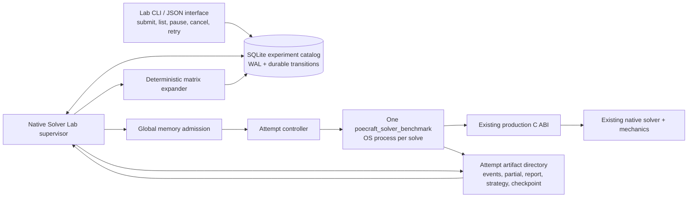

# Read-only architecture investigation

**Repository:** `OliverOrton/poecraft2`
**Exact ref:** `769c3deb1a2a2913c228c4135c764271f662bef9`

No repository modifications, commits, pushes, issues, or other public actions were performed. This was a source-and-document architecture audit; I did not execute the fixed PDR witness or any test suite.

## Executive conclusion

The **Native Solver Lab should be an additive Python control plane around the existing corpus runner and `poecraft_solver_benchmark`**, not a new solver harness and not a second mechanics implementation.

The recommended v0 architecture is:

1. A persistent SQLite catalog and foreground supervisor.
2. Deterministic matrix expansion into immutable jobs.
3. One existing native benchmark OS process per solve.
4. Attempt-specific artifact directories and append-only attempt history.
5. Process-level memory admission, watchdog, cancellation, and crash recovery in the supervisor.
6. A narrowly scoped **active scheduler-continuation checkpoint** added to the existing native-development checkpoint format.
7. CLI and machine-readable JSON output only. Polished GUI work is explicitly deferred.

The PDR blockage is not evidence that the machine merely needs more RAM. The coarse replay changed the problem being solved: a 1,207-state prepared graph coexisted with 7,242 live carriers and 61,476 rows, and replay produced a different incumbent, termination, and open-obligation set. Memory attribution was correctly stopped before any repair was attempted.

---

# 1. Current capability map

| Area                      | Capability at the pinned ref                                                                                                                                                                                                                                                 | Architectural consequence                                                                                                                  |
| ------------------------- | ---------------------------------------------------------------------------------------------------------------------------------------------------------------------------------------------------------------------------------------------------------------------------- | ------------------------------------------------------------------------------------------------------------------------------------------ |
| Native benchmark          | `poecraft_solver_benchmark` builds sessions, solver, economy, and strategy objects through the production C ABI; it steps `pc_solver_solve_step`, records bounds and resource counters, compiles policies, and can run independent exact evaluation and simulation.          | Keep it as the only native solve worker. There is no reason to create a second C++ executable for v0.                                      |
| Process isolation         | `solver_corpus_runner.py` launches one benchmark subprocess per case, places it in a new process group/session, kills the process tree on watchdog expiry, and verifies that the parent process is gone.                                                                     | This is the correct worker model. Extend it rather than moving multiple solves into one process.                                           |
| Parallel corpus execution | The runner uses controller threads, but each future owns a separate benchmark process. It limits process count and sums declared memory reservations before launching.                                                                                                       | Controller threads are acceptable; the isolation unit remains one OS process per solve.                                                    |
| Resume                    | The current v2 runner atomically rewrites a JSON ledger, validates experiment provenance, and skips completed cases whose reports still exist.                                                                                                                               | Useful resumability exists, but it is a snapshot ledger rather than a persistent queue or attempt catalog.                                 |
| Partial observations      | The benchmark atomically replaces a unique partial-result sidecar at completed native-step boundaries. A watchdog observation is analyzable only if it contains the selected case and at least one bound sample; it remains a timeout rather than being relabelled complete. | Preserve this contract. Partial data is analysis evidence, not resume state.                                                               |
| Provenance                | The runner records source commit and dirty paths, executable SHA-256, corpus and artifact hashes, machine identity, Python version, and run configuration.                                                                                                                   | The lab should retain these fields and add attempt, checkpoint, command, and admission provenance.                                         |
| Coarse graph checkpoint   | The existing native binary format stores the ordered calculator state space, dynamic planners, state-local automatic admission, action-envelope evidence, and price-independent sparse graph arenas. It has layout guards, identity, length, and checksum.                   | Reuse this payload as the first section of a scheduler-aware checkpoint. Do not replace it.                                                |
| Checkpoint lifecycle      | The current C API refuses checkpoint save while `SolveWork` is active. `pc_solver_solve_finish` moves the result and then destroys `solve_work`.                                                                                                                             | Merely adding more fields to the existing post-finish serializer cannot preserve the scheduler. An active-safe-point snapshot is required. |
| Scheduler representation  | The weighted lane scheduler has explicit profiles, lane quotas and telemetry, a ticket cursor, and dispatch count. Selection mutates these fields.                                                                                                                           | At minimum, the ticket cursor and dispatch state are behavior-bearing. Full lane state is small enough to preserve for exact parity.       |
| Incremental continuation  | `SolveWork::Impl` explicitly owns carrier orders and epochs, multiple cursors, delayed rows and statuses, classification state, refinement state, frontiers, restricted values, policy state, incumbent state, and properness evidence.                                      | These are not reconstructible from the last prepared coarse graph alone.                                                                   |
| Build/test structure      | CMake already defines one native benchmark target linked to the production engine and a partitioned native solver test executable containing API, solve, refinement, and quotient-proof suites.                                                                              | The queue needs no new native target. Checkpoint tests can initially use existing test translation units.                                  |

The existing coarse checkpoint was proven useful on a small dynamic-action control, including matching transition, policy, compiled strategy, and exact-evaluation identities. Its measured total runtime was not automatically faster because downstream work still ran normally.

---

# 2. Gap analysis

## Lab/control-plane gaps

| Gap                            | Current behavior                                                                                                          | Required v0 behavior                                                                                                    |
| ------------------------------ | ------------------------------------------------------------------------------------------------------------------------- | ----------------------------------------------------------------------------------------------------------------------- |
| No persistent pending queue    | Pending and running tasks live only in the runner process.                                                                | Persist every experiment, job, attempt, command, and terminal transition in SQLite.                                     |
| No attempt history             | The JSON ledger stores one current record per case.                                                                       | Every retry or replay is a new immutable attempt under the same job.                                                    |
| Output collisions              | Partials contain an attempt ID, but final reports and logs use case-based paths and can be overwritten by later attempts. | Give every attempt a unique root directory. Never overwrite another attempt’s raw artifacts.                            |
| No priorities or matrices      | Cases are sorted by ID and processed from an in-memory list.                                                              | Deterministic matrix expansion, priorities, enqueue order, replicates, include/exclude rules, and persistent filtering. |
| No interactive controls        | No queued pause, cancel request, manual retry, or job-level state machine.                                                | Persistent control requests applied by the supervisor.                                                                  |
| Weak supervisor recovery       | The ledger survives, but active process ownership, leases, and claims do not.                                             | Supervisor sessions, attempt leases, orphan reconciliation, and process-identity tokens.                                |
| No structured worker protocol  | The runner receives only combined stdout and files after or during the run.                                               | Versioned event and control sidecars with monotonic sequence/generation numbers.                                        |
| Atomic, not power-loss durable | `_atomic_json` closes and renames a temporary file but does not explicitly fsync the file and parent directory.           | SQLite `synchronous=FULL` for catalog transitions and fsync-backed publication for critical manifests/checkpoints.      |

## Replay/solver gaps

| Gap                                           | Why it matters                                                                                                                                          | Classification                                                         |
| --------------------------------------------- | ------------------------------------------------------------------------------------------------------------------------------------------------------- | ---------------------------------------------------------------------- |
| Active save is prohibited                     | Scheduler continuation disappears when `SolveWork` is destroyed.                                                                                        | Solver-replay architecture                                             |
| Carrier/order/cursor state absent             | The next generated carrier and row can differ even though mechanics are unchanged.                                                                      | Solver-semantic                                                        |
| Delayed-row status absent                     | Re-evaluating a pending, admitted, non-improving, or unresolved row in a different order changes the open envelope.                                     | Solver-semantic                                                        |
| Frontier and support state absent             | Refinement may expand a different set or order of states.                                                                                               | Solver-semantic                                                        |
| Restricted values/incumbent/properness absent | Classification and executable-upper decisions can change.                                                                                               | Solver-semantic                                                        |
| Resource consumption continuation absent      | Resetting consumed work can move the resource-stop boundary.                                                                                            | Solver-semantic                                                        |
| Memory-accounted retained state incomplete    | The witness stops on `max_solver_owned_bytes`; omitted retained containers can move that stop even if the mathematical graph eventually matches.        | Mixed resource/semantic                                                |
| No strict-partition snapshot                  | A checkpoint taken after strict proof state becomes live would need the oracle, partitions, obligations, kernels, dependencies, cursors, and incumbent. | Explicitly deferred unless the smaller scheduler boundary is falsified |

The archive’s required successor inventory agrees with the source-level finding: carrier identities/order/generations/cursors, delayed rows and status, support and focused frontiers, restricted values, incumbent/properness, complete ledger scheduling state, and graph generations must be preserved together.

---

# 3. Proposed component architecture



### Ownership boundaries

**The supervisor owns:**

* matrix expansion;
* queue state;
* priorities and retries;
* host memory admission;
* process launch and process-tree ownership;
* watchdogs and interactive controls;
* artifact hashing and cataloging;
* crash reconciliation.

**The existing benchmark owns:**

* case loading and validation;
* C-ABI object creation;
* native solve stepping;
* trajectory and result reporting;
* strategy compilation and independent evaluation;
* native checkpoint save/load calls.

**The production engine remains the sole owner of:**

* mechanics;
* state identity;
* action legality and transition kernels;
* Bellman and proof authority;
* solver caps and termination;
* executable policy and exact-evaluation semantics.

The Python lab may inspect case metadata such as declared caps for admission, but it must never reproduce action legality, outcome probabilities, or crafting rules.

---

# 4. Stable job-request schema

A job request should be immutable, typed, and directly serializable. It must not accept a free-form shell command or arbitrary benchmark arguments.

```json
{
  "schema_version": "poecraft_native_solver_lab_job_v1",
  "solve": {
    "repository": {
      "slug": "OliverOrton/poecraft2",
      "commit": "769c3deb1a2a2913c228c4135c764271f662bef9"
    },
    "executable": {
      "path": "build/engine/poecraft_solver_benchmark.exe",
      "sha256": "<required>"
    },
    "artifact": {
      "path": "data/compiled/current",
      "manifest_sha256": "<required>",
      "source_data_hash": "<required-or-null>",
      "game_data_sha256": "<required-or-null>",
      "strings_sha256": "<required-or-null>"
    },
    "corpus": {
      "manifest_path": "fixtures/solver-exact-same-side/v1/gate4-manifest.json",
      "manifest_sha256": "<required>",
      "corpus_id": "<required>",
      "schema_version": "<required>"
    },
    "case": {
      "id": "conquest-lamellar-allflame-clean-4-pdr-product8",
      "document_path": "<resolved-case-path>",
      "document_sha256": "<required>"
    },
    "benchmark": {
      "exact_strategy_evaluation": true,
      "run_verification": false,
      "goal_progress_gated_reforges_override": null,
      "max_discovered_states_override": null,
      "verification_runs": null,
      "verification_seed": null,
      "verification_chunk_runs": null,
      "verification_time_limit_ms": null,
      "exact_evaluation_time_limit_ms": null
    }
  },
  "checkpoint": {
    "mode": "none",
    "kind": null,
    "input": null,
    "save_boundary": null,
    "require_no_fallback_rebuild": true
  },
  "execution": {
    "watchdog_ms": 900000,
    "solver_processes": 1,
    "reservation_bytes": 1342177280,
    "process_headroom_bytes": 268435456,
    "cancel_grace_ms": 10000
  },
  "measurement": {
    "replicate_index": 0
  },
  "retention": {
    "retain_stdout": true,
    "retain_events": true,
    "retain_partial": true,
    "retain_final_report": true,
    "retain_strategy": true,
    "retain_checkpoint": true
  }
}
```

For a save job:

```json
"checkpoint": {
  "mode": "save",
  "kind": "scheduler_continuation_v1",
  "input": null,
  "save_boundary": "incremental_dispatch_pre_strict_v1",
  "require_no_fallback_rebuild": true
}
```

For replay:

```json
"checkpoint": {
  "mode": "replay",
  "kind": "scheduler_continuation_v1",
  "input": {
    "checkpoint_id": "<catalog-id>",
    "path": "<resolved-path>",
    "sha256": "<required>",
    "caller_identity_sha256": "<required>"
  },
  "save_boundary": null,
  "require_no_fallback_rebuild": true
}
```

### Request identity rules

Use two hashes:

* **`solve_identity_sha256`**: path-independent identity over the case, artifact, executable, benchmark options, solver-affecting checkpoint identity, and repository commit.
* **`request_sha256`**: the complete immutable job request, including resource reservation and retention policy.

Paths are bindings; their hashes are authority. A file moved without changing its hash can retain the same solve identity.

Other rules:

* Canonical UTF-8 JSON with sorted object keys.
* Bytes and durations are integers.
* No NaN or infinity in request JSON.
* Unknown v1 fields are rejected.
* `solver_processes` must equal `1`.
* Priority, current state, labels, enqueue time, and retry count are catalog metadata, not part of the immutable request.
* A retry uses the same job and request hash but receives a new attempt.
* A deliberate timing replicate is a distinct job with a distinct `replicate_index`.
* Changing a solver cap, action-scope flag, case document, economy, artifact, or checkpoint changes the solve identity.

### Matrix document

The matrix layer can remain small:

```json
{
  "schema_version": "poecraft_native_solver_lab_matrix_v1",
  "name": "pdr-checkpoint-triplet",
  "base_job": "<job-object>",
  "axes": [
    {
      "path": "/checkpoint/mode",
      "values": ["none", "save", "replay"]
    }
  ],
  "include": [],
  "exclude": [],
  "replicates": 1
}
```

Expansion is a deterministic cross-product in canonical axis order. Each job stores its resolved coordinates. Re-submitting the same matrix hash is idempotent unless the caller explicitly requests additional replicates.

---

# 5. SQLite experiment catalog

The native benchmark processes should never write SQLite. The CLI inserts requests and the supervisor owns authoritative state transitions.

```sql
PRAGMA foreign_keys = ON;
PRAGMA journal_mode = WAL;
PRAGMA synchronous = FULL;
PRAGMA busy_timeout = 5000;

CREATE TABLE catalog_meta (
    key             TEXT PRIMARY KEY,
    value           TEXT NOT NULL
);

CREATE TABLE supervisor_sessions (
    supervisor_id       TEXT PRIMARY KEY,
    host_fingerprint    TEXT NOT NULL,
    boot_id             TEXT,
    pid                 INTEGER NOT NULL,
    version             TEXT NOT NULL,
    started_at          TEXT NOT NULL,
    heartbeat_at        TEXT NOT NULL,
    ended_at            TEXT
);

CREATE TABLE experiments (
    experiment_id       TEXT PRIMARY KEY,
    schema_version      TEXT NOT NULL,
    name                TEXT NOT NULL,
    matrix_json         TEXT NOT NULL,
    matrix_sha256       TEXT NOT NULL,
    state               TEXT NOT NULL CHECK (
        state IN ('active', 'paused', 'canceling',
                  'completed', 'failed', 'canceled')
    ),
    desired_state       TEXT NOT NULL CHECK (
        desired_state IN ('run', 'pause', 'cancel')
    ),
    created_at          TEXT NOT NULL,
    updated_at          TEXT NOT NULL,
    UNIQUE(matrix_sha256, name)
);

CREATE TABLE jobs (
    job_id                  TEXT PRIMARY KEY,
    experiment_id           TEXT NOT NULL
                                REFERENCES experiments(experiment_id)
                                ON DELETE CASCADE,
    request_json            TEXT NOT NULL,
    request_sha256          TEXT NOT NULL,
    solve_identity_sha256   TEXT NOT NULL,
    matrix_coordinates_json TEXT NOT NULL,
    replicate_index         INTEGER NOT NULL DEFAULT 0
                                CHECK (replicate_index >= 0),

    priority                INTEGER NOT NULL DEFAULT 0,
    enqueue_seq             INTEGER NOT NULL,
    state                   TEXT NOT NULL CHECK (
        state IN (
            'queued', 'blocked_memory', 'running',
            'pause_pending', 'paused', 'retry_wait',
            'succeeded', 'failed', 'canceled'
        )
    ),
    desired_state           TEXT NOT NULL DEFAULT 'run' CHECK (
        desired_state IN ('run', 'pause', 'cancel')
    ),

    solver_owned_cap_bytes  INTEGER NOT NULL DEFAULT 0,
    reservation_bytes       INTEGER NOT NULL CHECK (reservation_bytes >= 0),
    watchdog_ms             INTEGER NOT NULL CHECK (watchdog_ms > 0),
    max_attempts            INTEGER NOT NULL DEFAULT 1 CHECK (max_attempts > 0),
    attempts_started        INTEGER NOT NULL DEFAULT 0,
    next_eligible_at        TEXT,
    terminal_reason         TEXT,

    created_at              TEXT NOT NULL,
    updated_at              TEXT NOT NULL,

    UNIQUE(experiment_id, request_sha256, replicate_index)
);

CREATE INDEX jobs_dispatch
    ON jobs(state, desired_state, priority DESC, enqueue_seq ASC);

CREATE TABLE attempts (
    attempt_id              TEXT PRIMARY KEY,
    job_id                  TEXT NOT NULL
                                REFERENCES jobs(job_id)
                                ON DELETE CASCADE,
    ordinal                 INTEGER NOT NULL CHECK (ordinal > 0),
    state                   TEXT NOT NULL CHECK (
        state IN (
            'claimed', 'starting', 'running', 'checkpointing',
            'paused_checkpointed', 'succeeded', 'failed',
            'canceled', 'orphaned'
        )
    ),

    supervisor_id           TEXT
                                REFERENCES supervisor_sessions(supervisor_id),
    lease_token             TEXT NOT NULL,
    lease_expires_at        TEXT NOT NULL,
    heartbeat_at            TEXT,

    pid                     INTEGER,
    process_group_token     TEXT,
    process_start_token     TEXT,
    host_boot_id            TEXT,

    request_sha256          TEXT NOT NULL,
    artifact_root           TEXT NOT NULL,
    command_json            TEXT NOT NULL,

    started_at              TEXT,
    ended_at                TEXT,
    exit_code               INTEGER,
    native_status           TEXT,
    failure_kind            TEXT,
    retryable               INTEGER NOT NULL DEFAULT 0
                                CHECK (retryable IN (0, 1)),
    partial_available       INTEGER NOT NULL DEFAULT 0
                                CHECK (partial_available IN (0, 1)),

    UNIQUE(job_id, ordinal)
);

CREATE INDEX attempts_active
    ON attempts(state, lease_expires_at);

CREATE TABLE attempt_events (
    event_id            INTEGER PRIMARY KEY AUTOINCREMENT,
    attempt_id          TEXT
                            REFERENCES attempts(attempt_id)
                            ON DELETE CASCADE,
    worker_seq          INTEGER,
    observed_at         TEXT NOT NULL,
    kind                TEXT NOT NULL,
    payload_json        TEXT NOT NULL
);

CREATE UNIQUE INDEX attempt_worker_event_seq
    ON attempt_events(attempt_id, worker_seq)
    WHERE worker_seq IS NOT NULL;

CREATE TABLE artifacts (
    artifact_id         TEXT PRIMARY KEY,
    attempt_id          TEXT NOT NULL
                            REFERENCES attempts(attempt_id)
                            ON DELETE CASCADE,
    kind                TEXT NOT NULL,
    logical_name        TEXT NOT NULL,
    relative_path       TEXT NOT NULL,
    sha256              TEXT NOT NULL,
    size_bytes          INTEGER NOT NULL CHECK (size_bytes >= 0),
    media_type          TEXT,
    complete            INTEGER NOT NULL CHECK (complete IN (0, 1)),
    created_at          TEXT NOT NULL,

    UNIQUE(attempt_id, kind, logical_name)
);

CREATE TABLE checkpoints (
    checkpoint_id               TEXT PRIMARY KEY,
    artifact_id                 TEXT NOT NULL UNIQUE
                                    REFERENCES artifacts(artifact_id)
                                    ON DELETE CASCADE,
    checkpoint_kind             TEXT NOT NULL,
    format_version              INTEGER NOT NULL,
    boundary_kind               TEXT NOT NULL,
    caller_identity_sha256      TEXT NOT NULL,
    request_sha256              TEXT NOT NULL,
    graph_fingerprint           TEXT NOT NULL,
    scheduler_fingerprint       TEXT,
    continuation_fingerprint    TEXT,
    owned_bytes_fingerprint     TEXT,
    valid                       INTEGER NOT NULL CHECK (valid IN (0, 1)),
    validation_json             TEXT NOT NULL
);

CREATE TABLE control_requests (
    control_id          TEXT PRIMARY KEY,
    target_type         TEXT NOT NULL CHECK (
        target_type IN ('experiment', 'job', 'attempt')
    ),
    target_id           TEXT NOT NULL,
    action              TEXT NOT NULL CHECK (
        action IN ('pause', 'resume', 'cancel', 'retry')
    ),
    requested_at        TEXT NOT NULL,
    requested_by        TEXT,
    state               TEXT NOT NULL CHECK (
        state IN ('pending', 'applied', 'rejected')
    ),
    result_json         TEXT
);
```

### Transaction boundaries

* Matrix and all generated jobs are inserted in one transaction.
* Claiming a job, incrementing `attempts_started`, inserting its attempt, and reserving its memory happen under `BEGIN IMMEDIATE`.
* The process is spawned only after the claim transaction commits.
* Artifact hashes are inserted before the attempt becomes terminal.
* Final attempt and aggregate job state are committed together.
* CLI controls become durable `control_requests`; the supervisor applies them idempotently.
* A retry never edits or deletes the previous attempt.

---

# 6. Worker/supervisor protocol

The “worker” is the existing `poecraft_solver_benchmark` process. There should not be a persistent native worker daemon.

## Attempt launch

1. Supervisor selects and reserves a job.
2. It creates an attempt directory and writes immutable `request.json` and `launch.json`.
3. It constructs the existing benchmark command using a factored helper from `solver_corpus_runner.py`.
4. The process receives a new process group/session exactly as it does today.
5. The supervisor records PID, process-group token, host boot ID, and process-start token.
6. The process emits a `hello` event containing attempt ID, PID, ABI, compiler, benchmark schema, and caller-identity hash.
7. The benchmark writes existing partial/final reports and additionally emits structured events.
8. The supervisor validates and hashes artifacts.
9. The terminal state is committed only after process exit, no-survivor verification, and artifact validation.

## Proposed additive benchmark flags

```text
--lab-attempt-id ATTEMPT_ID
--lab-event-output PATH
--lab-control-path PATH
--lab-attempt-status PATH
--checkpoint-boundary incremental_dispatch_pre_strict_v1
```

Existing `--save-development-checkpoint` and `--load-development-checkpoint` remain the file-selection interface.

## Worker event format

```json
{
  "schema_version": "poecraft_native_solver_lab_event_v1",
  "attempt_id": "<id>",
  "seq": 17,
  "kind": "bound_sample",
  "monotonic_ms": 8421,
  "payload": {
    "phase": 3,
    "round": 4,
    "lower_bound": 21.772459401271156,
    "upper_bound": 7866.432124027084,
    "states": 1207,
    "rows": 61476
  }
}
```

Useful event kinds:

* `hello`
* `phase_changed`
* `bound_sample`
* `control_acknowledged`
* `checkpoint_ready`
* `checkpoint_written`
* `partial_written`
* `final_report_written`
* `terminal`

JSONL permits recovery from a truncated last line: import complete lines, ignore the incomplete suffix, and use `(attempt_id, seq)` for idempotence.

## Control mailbox

The supervisor atomically replaces:

```json
{
  "schema_version": "poecraft_native_solver_lab_control_v1",
  "attempt_id": "<id>",
  "generation": 3,
  "action": "pause",
  "requested_at": "<UTC timestamp>"
}
```

The benchmark checks for a newer generation only after a completed `pc_solver_solve_step`. That matches the repository’s existing observation boundary: there is no honest sub-step trajectory or checkpoint inside one blocking native step.

Consequences:

* A cooperative pause or cancel can be delayed by one long native step.
* A hard cancellation grace timer remains necessary.
* No report may imply sub-step responsiveness.
* Event/control I/O is solver-state-neutral but not performance-neutral. Wall-time comparisons must use identical instrumentation settings.

## Process-death behavior

* **Windows:** assign each benchmark process to a Job Object with kill-on-close in addition to the existing process group.
* **Linux:** the benchmark can set a parent-death signal from a supervisor PID/token passed at launch.
* **Other POSIX:** retain the process group; if ownership cannot be proven after supervisor restart, mark the attempt `orphaned` and do not launch a duplicate automatically.

No additional wrapper process is required.

---

# 7. Global memory admission algorithm

The current runner initializes its reservation from `caps.max_solver_owned_bytes`. That cap is not a complete full-process reservation. The fixed witness used a 1 GiB solver-owned cap but recorded a native peak of `1,179,431,999` bytes—about 100.8 MiB above the cap.

Therefore:

* **`max_solver_owned_bytes` is solver-semantic input.**
* **`reservation_bytes` is host scheduling policy.**
* Changing the former creates a different solve.
* Changing the latter changes only whether and when the same solve is launched.

## Reservation calculation

```text
if explicit reservation_bytes is present:
    require reservation_bytes >= max_solver_owned_bytes
    R = reservation_bytes

else if max_solver_owned_bytes > 0:
    R = max_solver_owned_bytes
        + configured_process_headroom_bytes

else:
    R = EXCLUSIVE
```

A provisional local default of 256 MiB headroom is reasonable for initial safety, but it must be visible in the request and experiment provenance rather than hidden in code. Historical measurements may later suggest reservations, but v0 must not automatically lower them.

## Admission procedure

```text
pool_budget =
    configured_global_budget
    - supervisor_reserve
    - emergency_reserve

repeat while a worker slot is free:

    candidates =
        queued jobs whose retry delay has elapsed
        and whose desired state is run

    sort by:
        effective priority descending
        enqueue sequence ascending

    for the head candidate:

        if R(job) > pool_budget:
            mark blocked_memory with "reservation_exceeds_pool"
            continue to next permanently inadmissible job

        if sum(active reservations) + R(job) <= pool_budget
           and OS-available-memory >= R(job) + emergency_reserve:
            atomically reserve and start job
            continue outer loop

        if the head job has waited beyond the backfill window:
            enter drain mode for that job
            start no lower-priority work
            stop admission for now

        otherwise:
            backfill the first same-or-lower-priority candidate that fits

    if nothing fits:
        stop admission
```

Additional rules:

* Reserve before process spawn.
* Release only after exit and process-tree survivor verification.
* Jobs with unknown memory requirements run exclusively.
* Actual RSS/native peaks are recorded but do not retroactively change the active reservation.
* A host-memory safety veto is recorded as `blocked_memory`, not as a solver result.
* An OS OOM is an infrastructure failure. It is not equivalent to a solver `max_solver_owned_bytes` termination.
* A retry after OS OOM may run exclusively under the same solver caps. The supervisor must not silently raise `max_solver_owned_bytes`.

Most importantly, raising the host pool or machine RAM does not repair the PDR replay mismatch. It can make a different or longer experiment possible, but it cannot establish faithful continuation. The PDR investigation stopped because replay semantics diverged before memory attribution began.

---

# 8. Pause, cancel, resume, and retry semantics

| Operation        | Queued job                                                          | Running job                                                                                                                                                    |
| ---------------- | ------------------------------------------------------------------- | -------------------------------------------------------------------------------------------------------------------------------------------------------------- |
| Pause experiment | No additional jobs are admitted; current attempts continue.         | Existing attempts drain unless individually paused.                                                                                                            |
| Pause job        | Moves immediately to `paused`. Queue position metadata is retained. | Moves to `pause_pending`. At the next supported safe point, write a valid scheduler checkpoint and exit. It becomes `paused` only after checkpoint validation. |
| Resume           | Returns to `queued`.                                                | A checkpointed pause creates a new replay attempt using the same job.                                                                                          |
| Cancel           | Moves immediately to `canceled`; no attempt is created.             | Send cooperative cancel. Benchmark writes its latest partial, calls `pc_solver_solve_abandon`, and exits. After the grace period, kill the process group.      |
| Retry            | Creates a new attempt under the same immutable job.                 | Not applicable until the active attempt is terminal.                                                                                                           |

## Important pause rule

Before scheduler-aware checkpoint support passes parity, **pause means dispatch pause only**. A running attempt must not be described as paused/resumable merely because the OS process was suspended or killed.

Once checkpoint support exists:

* `pause_pending` is not terminal.
* A valid checkpoint plus clean worker exit is required for `paused_checkpointed`.
* If the solver is in an unsupported in-flight boundary, the request remains pending until a safe point.
* There is no force-pause. The alternatives are wait or cancel.
* An already-written checkpoint may be retained after cancellation, but it is reusable only if its compatibility validation succeeds.

## Retry policy

Automatic retry is appropriate for:

* runner exception;
* abnormal native crash;
* verified OS OOM, normally with exclusive admission;
* supervisor crash/orphan cleanup;
* watchdog expiry, only when the experiment explicitly allows it.

Automatic retry is not appropriate for:

* exact closure;
* a solver-reported resource-cap result;
* requested bounded finish;
* expectation miss with a valid final report;
* manual cancellation;
* checkpoint incompatibility.

The existing runner deliberately treats benchmark exit code `2` plus a valid report as a completed measurement rather than a process failure. The lab must preserve that distinction.

A retry from checkpoint is allowed only when all of the following match:

* checkpoint format and kind;
* executable hash and ABI/layout identity;
* artifact and case hashes;
* resolved economy;
* start item;
* action vocabulary and order;
* solver options and caps;
* caller identity;
* checkpoint request hash.

Otherwise the retry is fresh or explicitly rejected. There must be no silent fallback from “checkpoint replay requested” to graph rebuilding.

---

# 9. Artifact and provenance layout

```text
solver-lab/
├── catalog.sqlite
├── catalog.sqlite-wal
├── catalog.sqlite-shm
├── experiments/
│   └── <experiment-id>/
│       ├── matrix.json
│       ├── matrix.sha256
│       └── summary.json                 # derived, rebuildable
├── jobs/
│   └── <job-id>/
│       ├── request.json
│       ├── request.sha256
│       └── solve-identity.sha256
└── attempts/
    └── <attempt-id>/
        ├── launch.json
        ├── provenance.json
        ├── command.json
        ├── control.json
        ├── events.jsonl
        ├── stdout.log
        ├── native-partial.json
        ├── native-report.json
        ├── attempt-status.json
        ├── strategies/
        │   └── ...
        ├── checkpoints/
        │   ├── scheduler-continuation.bin
        │   └── scheduler-continuation.summary.json
        └── manifest.json
```

### Artifact rules

* Every attempt directory is immutable after terminal publication.
* Temporary files use `.tmp` and are ignored during recovery.
* `manifest.json` is written last and contains path, kind, size, SHA-256, and completeness for every artifact.
* SQLite stores relative paths and hashes; it does not contain large report or checkpoint blobs.
* Raw benchmark reports are retained unchanged.
* Any flattened analytics row or experiment summary is derived and rebuildable.
* Checkpoints are development artifacts, not correctness evidence by themselves.
* A checkpoint summary records its format, caller identity, boundary, graph fingerprint, scheduler fingerprint, continuation fingerprint, and validation outcome.

### Provenance additions

Retain everything the current runner already records, plus:

* job/request/solve identity hashes;
* experiment and matrix hashes;
* attempt ordinal and retry parent;
* exact argv as an array;
* supervisor version and session ID;
* process-group ownership token;
* admission budget, reservation, active reservations, and safety-veto readings;
* checkpoint input/output hashes;
* structured event schema;
* benchmark ABI/compiler;
* wall-clock and monotonic timestamps;
* environment allowlist only—never dump secrets or the entire environment.

---

# 10. Partial-result and crash recovery behavior

## Normal partial publication

The current contract is sound:

* write after completed native steps;
* atomically replace the sidecar;
* require the selected case and at least one trajectory sample;
* never convert a partial timeout into a completed solve.

The lab should ingest each newly published partial into the event catalog but retain the raw latest sidecar.

## Process crash

After process exit:

1. Verify no process-tree survivor.
2. Parse only atomically published files.
3. Ignore `.tmp` files and a truncated JSONL suffix.
4. Validate attempt ID, case ID, request hash, and schema.
5. Hash all valid files.
6. If a valid final report exists, classify from the report and native exit contract.
7. Otherwise retain a valid partial as analysis-only evidence.
8. A partial without a checkpoint is never resumable.
9. Commit artifact rows and terminal attempt state in one transaction.
10. Apply retry policy.

## Supervisor crash

At startup:

1. Create a new supervisor session and boot token.
2. Find attempts in `claimed`, `starting`, `running`, or `checkpointing` with expired leases.
3. Reconcile process identity using PID, process-start token, process-group token, host boot ID, and platform ownership mechanism.
4. Kill a positively identified orphan; do not adopt it in v0.
5. If a process may still exist but ownership cannot be proven, mark `orphaned` and block automatic retry to avoid duplicate execution.
6. Inspect the attempt directory:

   * valid final report → finalize;
   * valid pause checkpoint and pause request → `paused_checkpointed`;
   * partial only → failed/orphaned with analyzable partial;
   * no valid artifact → infrastructure failure.
7. Release or preserve the memory reservation according to confirmed process state.
8. Requeue only when retry policy permits.

## Power loss

For state that must survive machine failure:

* SQLite uses WAL and `synchronous=FULL`.
* Checkpoints, final reports, and attempt manifests are flushed and fsynced before atomic rename.
* The parent directory is fsynced where supported.
* Event JSONL may lose the final unflushed event; the atomic partial/final report remains the recovery summary.
* Artifact publication is considered complete only after its hash is recorded and the attempt manifest is published.

---

# 11. Smallest scheduler-aware checkpoint

## Chosen boundary

The smallest credible extension is:

> **`incremental_dispatch_pre_strict_v1`: an active `SolveWork` checkpoint at an explicit outer dispatch safe point, after the previous work item has committed, before the next scheduler ticket or strict-partition operation is selected.**

At this boundary:

* no calculator row or automatic-admission transaction is in flight;
* no state expansion transaction is partially appended;
* no Bellman backup is half applied;
* no sparse-policy solve or policy-kernel preparation is active;
* no constructive fallback transaction is active;
* no strict partition/proof store has yet become live;
* all graph, row, ledger, frontier, value, incumbent, and cursor mutations from the prior work item are committed.

This is narrower than an arbitrary coroutine checkpoint and substantially smaller than a first-strict-partition snapshot.

The fixed PDR save run should select the **last such deterministic safe point before the first strict-partition insertion**. The trigger must be semantic, not elapsed-time based.

If the fixed witness cannot expose such a point while preserving ordinary behavior, then this design is falsified. The next step would be the broader first-strict-partition checkpoint identified by the archive—not a partial scheduler snapshot and not a larger RAM cap.

## Format strategy

Do not replace `PCSOLVEGRAPHV1`. Add a versioned outer format with sections:

```text
scheduler_checkpoint_v2
├── header_and_identity
├── coarse_graph_v1_payload
├── scheduler_continuation_v1
├── value_incumbent_properness_v1
├── resource_accounting_v1
└── section_directory_and_checksums
```

The current coarse checkpoint remains loadable under its existing completed-graph contract. The new checkpoint kind is explicit; a v1 graph checkpoint cannot be mistaken for a scheduler continuation.

The format remains:

* native-development-only;
* build/layout bound;
* disposable;
* absent from release WASM;
* neither proof authority nor publication evidence.

## Active C-ABI lifecycle

The existing save function rejects active work, so the lifecycle should become:

1. `SolveWork` reports whether the named safe point is available.
2. Benchmark requests an active development snapshot.
3. Engine captures a stable DTO without destroying or mutating `SolveWork`.
4. Serializer writes the combined graph and continuation.
5. Save run continues normally.
6. On load, a fresh solver stages the continuation.
7. `pc_solver_solve_begin` validates the supplied start item, economy, and options and consumes that staged continuation.
8. A mismatch rejects the begin. It never silently starts fresh.

A small native-only API addition is safer than changing the meaning of the existing completed-graph save call, for example:

```c
pc_result pc_solver_development_checkpoint_query_active(
    pc_solver_handle solver,
    pc_development_checkpoint_status* out_status,
    pc_error_info* out_error);

pc_result pc_solver_development_checkpoint_save_active(
    pc_solver_handle solver,
    const char* path,
    const char* caller_identity,
    pc_error_info* out_error);
```

The existing load API can detect the checkpoint kind and stage either a coarse graph or a full continuation.

---

# 12. Scheduler-aware checkpoint field inventory

## A. Existing coarse graph section — reuse unchanged

Persist the current authority:

* ordered abstract states;
* dynamic planner operators;
* candidate and dependency order;
* state-local automatic operator admission;
* sparse rows;
* variants;
* successors and probabilities;
* choices and choice successors/options;
* automatic evidence and Fracture witnesses;
* transition-cache action-envelope ledger;
* graph-affecting options and caller identity.

The existing checkpoint already carries this high-value price-independent state.

## B. Boundary and input identity

Persist or bind:

* checkpoint kind and safe-boundary enum;
* exact start item;
* solve options and all caps;
* resolved-economy hash;
* priced-operator vocabulary hash;
* caller-scope identity;
* current outer phase/subphase;
* calculator state/operator generations;
* transition-cache generation and counts;
* source and target graph generations;
* dynamic vocabulary size and fingerprint.

Prices may be reconstructed from the bound economy, but the reconstructed ordered priced operators and costs must match a checkpoint fingerprint before continuation is accepted.

## C. Scheduler state

For both `anytime_scheduler` and `focused_anytime_scheduler`:

* profile ID;
* profile quotas and constants;
* ticket cursor;
* dispatch count;
* all lane telemetry:

  * offers;
  * services;
  * waits;
  * yields;
  * improvements;
  * starvation events;
  * current wait;
  * maximum wait;
* `incremental_last_scheduled_lane`.

Although some counters are observational, the complete state is small and is required for strict triplet parity. The ticket cursor is directly behavior-bearing because each selection advances it.

## D. Incremental carriers, ordering, and generation cursors

Persist:

* `incremental_carriers`;
* `incremental_carrier_cursor`;
* automatic carrier cursor and epoch end;
* automatic carrier order and order cursor;
* fairness carrier order, epoch end, carrier cursor, operator cursor;
* high-progress carrier order, epoch end, carrier cursor;
* high-progress operator order and cursor;
* closure carrier and operator cursors;
* general incremental operator cursor;
* dynamic-prepared and prepare-active flags;
* resume-after-dynamic-prepare flag;
* dynamic operator cursor and indices;
* priority task vector and cursor;
* warm-start policy wave;
* epoch-added-states flag;
* warm-start continuation-refined flag.

Serializing the order arrays is safer than recomputing scores and hoping to regenerate the same stable ordering.

## E. Delayed rows and classification

Persist:

* delayed operator indices;
* every `IncrementalAlternativeRow`:

  * state;
  * operator;
  * row index;
  * status;
  * lower Q;
  * upper Q;
  * improvement margin;
  * states added;
* classification active/admitted/reclassify flags;
* restricted-graph-closed flag;
* classification cursor;
* classification upper source;
* certified lower vector;
* completed-pair authority;
* the **live** action-envelope ledger, including transition/revision counters;
* unevaluated, inapplicable, and resource-unresolved action counts;
* family/kernel reuse and proof counters needed for exact parity.

The row-status enum is behavior-bearing: pending, admitted, non-improving, and unresolved rows cannot be reconstructed from the graph alone.

## F. Frontiers, support, and refinement

Persist:

* expanded and queued masks;
* expansion queue and expanded count;
* missing-frontier states;
* chaos-support mask;
* non-chaos-seen mask;
* states-outside-support count;
* refinement-active flag;
* refinement target;
* refinement uncertainty;
* refinement rounds and selected-state counts;
* rows-reconsidered counts;
* post-upper-scheduling flag and cursor;
* next anytime row checkpoint;
* anytime policy attempts, successes, last completed row count, best upper, and checkpoint upper;
* focused-mode flags;
* focused lower proof snapshot and its initialization state where it remains authoritative.

At the selected safe point, expansion scratch such as `expansion_active`, partially appended rows, or active automatic admission must be absent. Otherwise save refuses.

## G. Restricted values, policy, incumbent, and properness

Persist:

* `result.values` used by the continuation;
* restricted certified upper values;
* restricted-values-ready flag;
* upper-policy dirty/pass/fixed-policy-proved flags;
* prior upper-policy bound;
* temporary upper-policy rows;
* policy rows and stable/initialized status;
* complete output incumbent, not only its scalar upper:

  * value vector;
  * selected rows and row costs;
  * policy operator references;
  * choices and frontier operators;
  * executable fallback;
  * graph and vocabulary identities;
  * source and target generations;
  * independently certified/evaluated flags;
  * proper and executable flags;
* successful fallback properness evidence;
* improper-policy states;
* any retained proof snapshot used by row classification.

The source explicitly separates an executable, proper, independently evaluated incumbent from an unverified selected policy estimate. Replay must preserve that distinction.

To keep the checkpoint narrow:

* an unresolved pending candidate may either be serialized completely or cause save refusal;
* active constructive fallback work causes refusal;
* active sparse-policy evaluation causes refusal;
* active policy-kernel preparation causes refusal.

The first implementation should choose refusal.

## H. Resource and stop-accounting continuation

Persist all counters that can affect when a cap fires:

* consumed logical reforge work by the active accounting contract;
* state, row, transition, refinement, strict-state, kernel, and strict-transition counts that are not already derivable from the graph;
* requested-bounded-finish latch;
* deferred resource-cap identity;
* open family/resource obligations;
* cap-hit and resource-accounting generation state;
* strict-frontier/work counters if nonzero at the chosen boundary.

External wall time is not part of the native checkpoint. For a paused job, the supervisor records consumed active wall time and gives the replay attempt only the remaining job watchdog allowance.

## I. Memory-accounting parity

This is essential for the PDR witness.

A mathematically complete continuation is still insufficient if omitted retained containers change the `max_solver_owned_bytes` stop. The checkpoint must record an owner-level memory-accounting fingerprint at save time and validate it immediately after load.

For every container counted by `live_owned_bytes()`:

* either serialize its authoritative contents;
* or deterministically rebuild it;
* and reproduce any cap-accounted capacity where capacity, rather than size, enters the ledger.

Likely owners requiring explicit inspection include:

* kernel-row memo tables;
* shared-kernel memo tables;
* automatic admission records;
* automatic carrier-work maps;
* retained incumbent and fallback structures;
* restricted value vectors;
* queue/order vector capacities;
* retained diagnostic samples or strings counted by the solver-owned ledger.

If an owner cannot be reconstructed to the same cap-accounted logical/capacity state, checkpoint load must refuse. It must not continue and hope to hit roughly the same memory boundary.

## J. Explicitly excluded from this checkpoint

Do not serialize:

* raw pointers or allocator addresses;
* threads, process handles, clocks, timestamps, or RSS;
* benchmark report/string caches;
* active calculator row internals;
* half-applied Bellman backups;
* sparse-policy coroutine scratch;
* active policy-kernel construction;
* active constructive fallback transactions;
* the persistent strict oracle;
* strict partitions;
* proof obligations and dependency graph;
* strict row kernels;
* in-progress strict-partition cursors.

The last five belong to a first-strict-partition checkpoint and are deferred unless the scheduler checkpoint fails its acceptance test.

---

# 13. Ordinary/save/replay parity test

Use only:

```text
conquest-lamellar-allflame-clean-4-pdr-product8
```

from the existing gate-4 corpus, with the unchanged Calculator product scope and unchanged 1 GiB solver-owned cap. The archived ordinary boundary is:

* independently evaluated upper: `7866.432124027084`;
* certified lower: `21.772459401271156`;
* strict reforge work: `3,507,568`;
* proof store plus quotient: `846,846,750` bytes;
* native peak: `1,179,431,999` bytes;
* stop: `max_solver_owned_bytes`.

## Three processes

### A. Ordinary

Fresh process, no checkpoint:

```text
poecraft_solver_benchmark
  --artifact ...
  --corpus .../gate4-manifest.json
  --case conquest-lamellar-allflame-clean-4-pdr-product8
  --output ordinary.json
  --partial-output ordinary-partial.json
  --exact-strategy-evaluation
```

### B. Save-and-continue

Fresh process, same request. Save at the deterministic `incremental_dispatch_pre_strict_v1` boundary, then continue in the same process to its ordinary terminal result.

This leg proves that capture and serialization themselves are behavior-neutral.

### C. Replay

Fresh process, exact same request, load the checkpoint from B, require scheduler-continuation reuse, and continue to terminal.

A requested scheduler replay that drops to coarse rebuild or fresh solve is a hard failure.

## Boundary assertions

Before and immediately after save:

* graph fingerprint unchanged;
* calculator state/operator generations unchanged;
* carrier/order/cursor fingerprint unchanged;
* delayed-row/status fingerprint unchanged;
* action-ledger fingerprint unchanged;
* scheduler ticket/counter fingerprint unchanged;
* frontier/support fingerprint unchanged;
* value/incumbent/properness fingerprint unchanged;
* owner-level memory-accounting fingerprint unchanged;
* no work counter advances during serialization.

On replay load:

* every boundary fingerprint matches;
* no extra scheduler ticket is consumed;
* no row is reclassified;
* no carrier/order vector is regenerated with a different identity;
* no open obligation is dropped or duplicated;
* no cap-work counter resets.

## Terminal semantic projection

The following must match exactly between A, B, and C:

* canonical request hash;
* ordered action scope and action-vocabulary hash;
* dynamic planner vocabulary and order;
* start state and goal identity;
* graph/source/target generations;
* incumbent kind and complete incumbent identity;
* independently evaluated upper and evaluation status;
* certified lower and provenance;
* strict-frontier insertions and identities;
* strict logical work;
* open-envelope obligation counts and hash;
* action-ledger lifecycle hash;
* resource stop and named cap;
* policy/strategy hash when publication reaches those stages;
* exact-evaluation success/off-policy identities;
* deterministic state, row, transition, and logical-work counts.

At minimum, the archived upper, lower, strict work, and `max_solver_owned_bytes` stop must be reproduced.

## Native-instrumentation projection

These are recorded but are not required to be equal:

* process ID;
* absolute paths;
* timestamps;
* checkpoint file size;
* load/save duration;
* total wall time;
* individual step durations;
* OS working set;
* process RSS/native peak outside the solver’s deterministic cap ledger;
* supervisor event timing.

Deterministic work counters are the first check for search-envelope equivalence; wall time is machine/load/compiler dependent. That matches the repository’s benchmark interpretation contract.

## Negative controls

Add focused tests that prove refusal for:

* different case JSON;
* different resolved economy;
* different action scope or ordering;
* different solver cap or option;
* different executable/layout identity;
* corrupted or truncated payload;
* scheduler checkpoint loaded as a coarse checkpoint;
* missing scheduler section;
* mismatched ticket cursor or order fingerprint;
* active calculator row;
* active Bellman backup;
* active sparse-policy resume;
* already-live strict proof store;
* nonfresh solver handle;
* fallback rebuild after replay was required.

The existing coarse-checkpoint tests remain valid for completed graph replay. They should not be weakened to make the PDR case saveable.

---

# 14. Minimal file-level implementation sequence

## Phase 1 — Preserve and expose the existing runner substrate

**Files**

* `tools/ingest/poecraft_ingest/solver_corpus_runner.py`
* `tools/ingest/tests/test_solver_corpus_runner.py`

**Changes**

* Factor command construction into `_build_case_command`.
* Factor attempt path creation into an `AttemptPaths` structure.
* Factor process-result classification into a reusable function.
* Permit an explicit attempt root and attempt ID.
* Preserve the current `run_corpus` CLI and ledger behavior unchanged.

**Gate**

All existing runner tests pass, including watchdog cleanup, completed exit `2`, partial preservation, provenance resume, and memory refusal.

## Phase 2 — SQLite catalog and matrix expansion

**New files**

* `tools/ingest/poecraft_ingest/solver_lab_catalog.py`
* `tools/ingest/poecraft_ingest/solver_lab_matrix.py`
* `tools/ingest/poecraft_ingest/solver_lab.py`
* `tools/ingest/tests/test_solver_lab_catalog.py`
* `tools/ingest/tests/test_solver_lab_matrix.py`

**Gate**

* schema migration;
* canonical request hashing;
* idempotent matrix submission;
* include/exclude behavior;
* persistent pause/cancel/retry commands;
* no duplicate jobs after restart.

## Phase 3 — Supervisor, memory admission, and recovery

**New files**

* `tools/ingest/poecraft_ingest/solver_lab_supervisor.py`
* `tools/ingest/tests/test_solver_lab_supervisor.py`

**Changes**

* Reuse the factored runner process adapter.
* Add claims, leases, process tokens, memory reservation, attempt-specific directories, and startup reconciliation.
* Continue using one process per solve.

**Gate**

Synthetic subprocess tests for:

* queue restart;
* process crash;
* watchdog;
* OS-like OOM code;
* cancel escalation;
* stale lease;
* orphan handling;
* memory drain and exclusivity;
* no artifact overwrite across retries.

## Phase 4 — Native event and control protocol

**Files**

* `engine/benchmarks/solver_benchmark.cpp`
* runner/supervisor modules and tests

**Changes**

* Add attempt ID, JSONL event, control mailbox, and status sidecar flags.
* Poll control only after completed solve steps.
* Retain the existing report schemas and behavior.

**Gate**

Events and controls do not change deterministic solve outputs on a small fixture. A deliberately long step is honestly reported as non-interruptible until its step boundary.

## Phase 5 — Scheduler state DTO and safe point

**Files**

* `engine/src/solver_anytime_scheduler.hpp`
* `engine/src/solver_solve_contracts.hpp`
* `engine/src/solver_solve_types.hpp`
* `engine/src/solver_solve.cpp`
* `engine/src/solver_solve_incremental.cpp`

**Changes**

* Add explicit scheduler export/import state.
* Define `DevelopmentSchedulerContinuation`.
* Add the `incremental_dispatch_pre_strict_v1` safe-point predicate.
* Capture only at quiescent outer-dispatch boundaries.
* Add stable fingerprints and cross-reference validation.

**Gate**

Small native tests prove scheduler state round-trips without advancing a ticket, row, or carrier cursor.

## Phase 6 — Extend checkpoint serialization

**Files**

* `engine/src/solver_development_checkpoint.cpp`

**Changes**

* Preserve v1 coarse loading.
* Add sectioned scheduler checkpoint v2.
* Serialize continuation, incumbent/properness, resource counters, and owner-level memory fingerprint.
* Refuse every unsupported in-flight boundary.

**Gate**

Round-trip, mismatch, corruption, truncation, unsupported-boundary, and memory-owner validation tests.

## Phase 7 — Active native API and staged restore

**Files**

* `engine/include/poecraft/solver.h`
* `engine/src/solver_api.cpp`
* `engine/tests/test_solver_api.cpp`

**Changes**

* Add active checkpoint query/save entry points.
* Stage a loaded scheduler continuation on a fresh handle.
* Have `solve_begin` validate and consume it.
* Keep release-WASM exports unchanged.

**Gate**

Native API tests prove:

* save does not destroy active work;
* save-and-continue parity;
* fresh-handle replay;
* mismatch refusal;
* no silent rebuild;
* checkpoint APIs absent from WASM exports.

## Phase 8 — Benchmark parity integration

**Files**

* `engine/benchmarks/solver_benchmark.cpp`
* possibly a new Python comparator under `tools/ingest/poecraft_ingest/solver_checkpoint_parity.py`

**Changes**

* Deterministic boundary trigger.
* Checkpoint summary artifact.
* Semantic and instrumentation projections.
* Ordinary/save/replay comparator.

No new CMake executable is needed. If tests stay in `test_solver_api.cpp` and `test_solver_solve.cpp`, `engine/CMakeLists.txt` may not need a source-list change.

## Phase 9 — Fixed PDR acceptance

Run exactly the ordinary/save/replay triplet.

**Stop immediately if:**

* any action/request identity differs;
* upper/evaluation differs;
* lower differs;
* strict frontier/work differs;
* open obligations differ;
* resource stop differs;
* replay falls back to rebuilding;
* owner-level memory accounting cannot be reconstructed.

Only after this passes should the stopped PDR proof-memory attribution plan be reopened.

## Phase 10 — Documentation

Update:

* `docs/solver/resources-resume-replay.md`
* `docs/solver/benchmarking.md`
* `HANDOFF.md`
* a new archived implementation plan/result when selected

The documentation must continue to distinguish completed coarse graph replay, scheduler continuation replay, and any later strict-partition replay.

---

# 15. Native-only instrumentation versus solver-semantic divergence

| Change or difference                                   | Classification                     | Interpretation                                                     |
| ------------------------------------------------------ | ---------------------------------- | ------------------------------------------------------------------ |
| SQLite catalog, job IDs, attempt IDs                   | Native-only                        | No solver model effect                                             |
| Process count and host admission                       | Native-only, performance-affecting | Can change contention and wall time, not deterministic solver work |
| Host reservation/headroom                              | Native-only                        | Must not be confused with solver-owned cap                         |
| Event/log/partial output                               | Native-only, performance-affecting | Use identical modes in timing comparisons                          |
| OS RSS and process peak                                | Native-only observation            | Not a proof or lower/upper value                                   |
| Watchdog kill                                          | Infrastructure outcome             | Partial may be analyzable but is not a solver terminal result      |
| Case JSON, economy, artifact, action scope             | Solver-semantic                    | Different solve identity                                           |
| `max_solver_owned_bytes` or other solver cap           | Solver-semantic                    | Different resource-bounded problem                                 |
| Scheduler ticket cursor/order/cursors                  | Solver-semantic                    | Changes which work is performed next                               |
| Delayed-row completion/status                          | Solver-semantic                    | Changes the open action envelope                                   |
| Frontier/support queues                                | Solver-semantic                    | Changes graph/refinement continuation                              |
| Restricted values and incumbent/properness             | Solver-semantic                    | Changes classification and executable upper authority              |
| Consumed logical resource counters                     | Solver-semantic                    | Resetting them changes the stop boundary                           |
| Missing graph generation identity                      | Solver-semantic                    | Can attach proof/dependency state to the wrong graph               |
| Checkpoint save time or file size                      | Native-only                        | Not part of parity                                                 |
| Save operation mutating a scheduler field              | Solver bug                         | Save-and-continue parity must catch it                             |
| Replay with same mechanics but missing scheduler state | Solver-semantic divergence         | This is precisely what the stopped PDR experiment demonstrated     |

The important distinction is that mechanics can remain perfectly unchanged while replay still solves a different stochastic-search problem because its action-envelope and scheduler continuation differ.

---

# 16. Explicit v0 deferrals

| Deferred feature                                  | Reason                                                                                                                                            |
| ------------------------------------------------- | ------------------------------------------------------------------------------------------------------------------------------------------------- |
| **Polished GUI**                                  | v0 should expose CLI commands and stable JSON. No dashboard design, drag-and-drop matrices, rich charts, live graph rendering, or report browser. |
| Web/WASM integration                              | The lab is native-development infrastructure. Existing checkpoint APIs should remain absent from release WASM.                                    |
| Multiple solves in one native process             | Existing process isolation is safer and already handles watchdog cleanup.                                                                         |
| Remote/distributed workers                        | Requires authentication, artifact transport, host capabilities, and stronger leases; unnecessary for local v0.                                    |
| OS-level suspend/resume                           | Suspended memory is not a durable or portable checkpoint.                                                                                         |
| Arbitrary mid-row or mid-Bellman checkpoint       | Would require serializing coroutine/sparse-solver scratch and greatly expand the proof surface.                                                   |
| First-strict-partition checkpoint                 | Deferred unless the pre-strict scheduler continuation is falsified by the fixed PDR parity gate.                                                  |
| Automatic process adoption after supervisor crash | v0 kills or marks orphans; it does not attach to an unknown live solver.                                                                          |
| Learned memory estimator or NN scheduler          | Start with explicit conservative reservations and measured provenance.                                                                            |
| Automatic cap tuning                              | Changing solver caps creates a different experiment and cannot be a transparent recovery mechanism.                                               |
| Automatic claim that more RAM fixes PDR           | The existing blocker is replay-semantic divergence, not a completed memory diagnosis.                                                             |
| Mechanics or search-quality changes               | The lab milestone is infrastructure and replay fidelity, not a new action filter, bound, scheduler profile, or mechanic rule.                     |
| Artifact garbage collection and compression       | Retain complete raw attempts until the catalog and recovery behavior are stable.                                                                  |
| Multi-user service, authentication, cloud storage | Outside a local native experiment lab.                                                                                                            |

---

# Final recommended boundary

The smallest coherent v0 is:

1. **SQLite queue and attempt catalog around the existing runner.**
2. **One existing benchmark process per solve.**
3. **Attempt-specific artifacts and durable recovery.**
4. **Explicit host-memory admission separate from solver caps.**
5. **Queue pause/cancel/retry, with running pause disabled until checkpoint parity.**
6. **A scheduler-continuation checkpoint at a quiescent pre-strict dispatch boundary.**
7. **The fixed PDR ordinary/save/replay triplet as the mandatory acceptance gate.**
8. **No polished GUI and no return to PDR memory repair until that gate passes.**

This preserves the repository’s current production mechanics and benchmark authority, extends rather than replaces the validated runner/checkpoint work, and directly addresses the falsified replay boundary instead of obscuring it with a larger memory limit.
